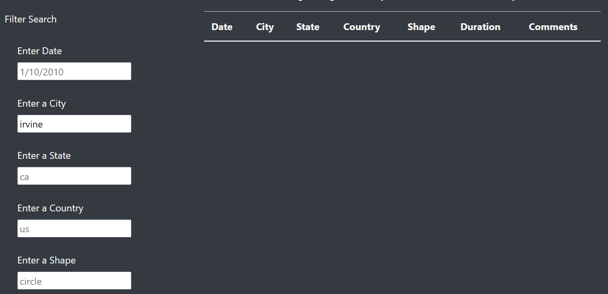
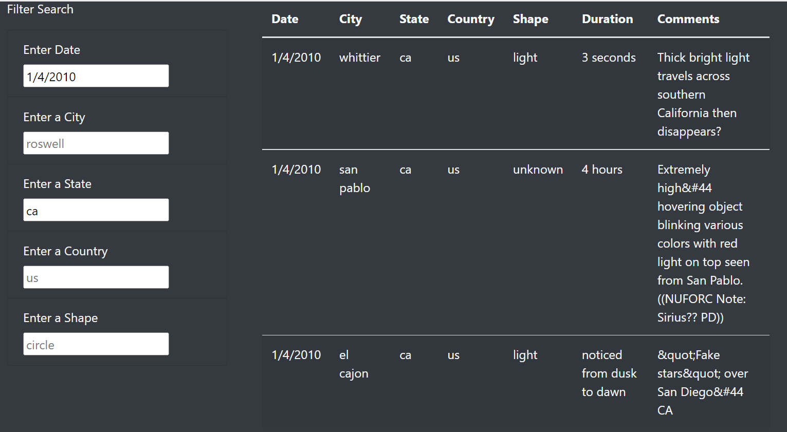

# UFOs

## Project Overview
This project is to add more in-depth analysis to Dana's UFO sightings webpage by allowing users to filter for multiple criteria (date, city, state, country, and shape) at the same time.

## Results
Additional filters have been added to the webpage's existing date filter. The filter button was removed so that anytime an input field changes, the table will update.

Let's say an Irvine, CA resident remembers seeing some strange lights in the sky on 1/4/2010. They are curious if there were other sightings on the same night. After finding our website, they ambitiously enter "irvine" into the city field. Unfortunately, this returns no results...

This user doesn't give up just yet. They delete "irvine" and enter "1/4/2010" into the city field. This produces too many results in far away places, so they also enter "ca" into the State input box. And sure enough, there were three other sightings in California that same night!

# Summary
One drawback to this webpage design is that it will not match capital letters in the search fields to lowercase letters in the data. In the app.js file, perhaps code could be added to the if else statement of the updateFilters function to allow for capitalization discrepencies.

Also, the placeholders in the filter boxes can be mistaken for entered search terms after a search is performed. I recommend changing the font colors and opacities so that the visual difference between placeholders and entered terms is more distinct.